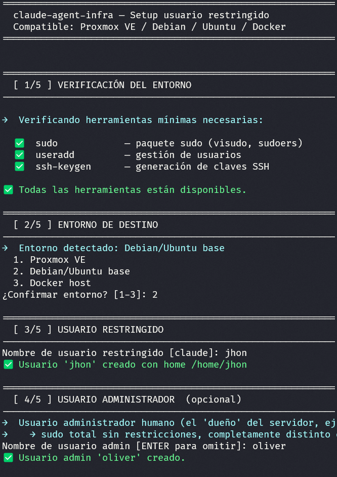
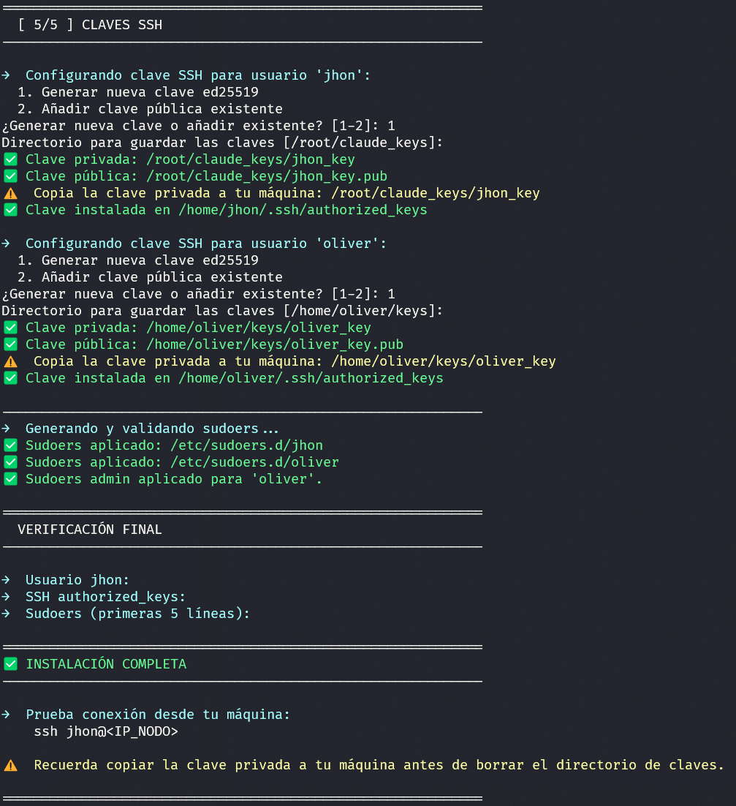

# claude-agent-infra

Toolkit to deploy a restricted user compatible with Claude Code on Linux servers, Proxmox VE, and Docker hosts.

Includes the setup script, a generic `CLAUDE.md`, and a technical skill ready to use with Claude Code.

---

## What's included

| File | Description |
|---|---|
| `setup.py` | Guided interactive script — step by step, no Linux expertise required. It detects the environment automatically and handles user creation, SSH key setup, and permission configuration. When it finishes, Claude Code is ready to connect to the server. |
| `CLAUDE.md` | Generic Claude Code configuration: modes, red zones, language, profiles |
| `skills/proxmox_linux_skill.md` | Technical skill: how Claude works safely with generic Linux and Proxmox |

---

## Compatibility

| Environment | Status |
|---|---|
| Proxmox VE 8+ | ✅ |
| Debian 12+ | ✅ |
| Ubuntu Server 22.04+ / 24.04 | ✅ |
| Docker host (Debian-based) | ✅ |
| CentOS / RHEL / Alpine | ❌ |

---

## Prerequisites

- Root access to the server
- Python 3 installed on the server
- SSH client configured on your machine (Windows / Mac / Linux)

> Missing tools (`sudo`, `ssh-keygen`) are detected and installed automatically with your confirmation.

---

## Installation

### 1. Download the script on the server

```bash
curl -O https://raw.githubusercontent.com/CTRQuko/claude-agent-infra/main/setup.py
```

### 2. Run it as root

```bash
sudo python3 setup.py
```

The script starts by asking your preferred language, then guides you through **5 steps**:

```
  1. Español
  2. English
Selecciona idioma / Select language [1-2]:
```





### 3. Copy the private key to your machine

```bash
# From your Windows/Mac machine
scp root@<SERVER_IP>:/root/claude_keys/claude_key ~/.ssh/claude_key
```

### 4. Test the connection

```bash
ssh claude@<SERVER_IP>
```

---

## Claude Code setup

### Place the files on your machine

```
~/.claude/CLAUDE.md                        ← copy or adapt the CLAUDE.md from this repo
~/.claude/skills/proxmox-linux/
    └── proxmox_linux_skill.md             ← copy the skill from this repo
```

### Configure the SSH alias (optional but recommended)

```
# ~/.ssh/config
Host my-server
    HostName <SERVER_IP>
    User claude
    IdentityFile ~/.ssh/claude_key
```

---

## Available modes in Claude Code

| Mode | Default model | When to use |
|---|---|---|
| `plan` | Haiku | Design, analyze, propose — Claude executes nothing |
| `interactivo` | Sonnet | First time / risk / troubleshooting — confirms block by block |
| `auto` | Sonnet | Known routines / read-only — executes without pauses |
| `super` | Opus | No restrictions — explicit 3-step activation required |

### Claude Code language

`IDIOMA_ACTIVO` in `CLAUDE.md` controls the language of **Claude's responses** — not the setup script.

```
IDIOMA_ACTIVO = ES   ← Claude responds in Spanish (default)
IDIOMA_ACTIVO = EN   ← Claude responds in English
```

> The setup script has its own language selector at startup (see Installation above).

---

## Red zones

Claude will **never execute** without explicit confirmation:

- `pct destroy` / `qm destroy` / `zfs destroy`
- `rm -rf` on critical paths
- Direct edits to `/etc/sudoers`
- User creation or deletion without review
- Network or firewall changes that could cut SSH access

---

## License

MIT — use it, adapt it, share it.
